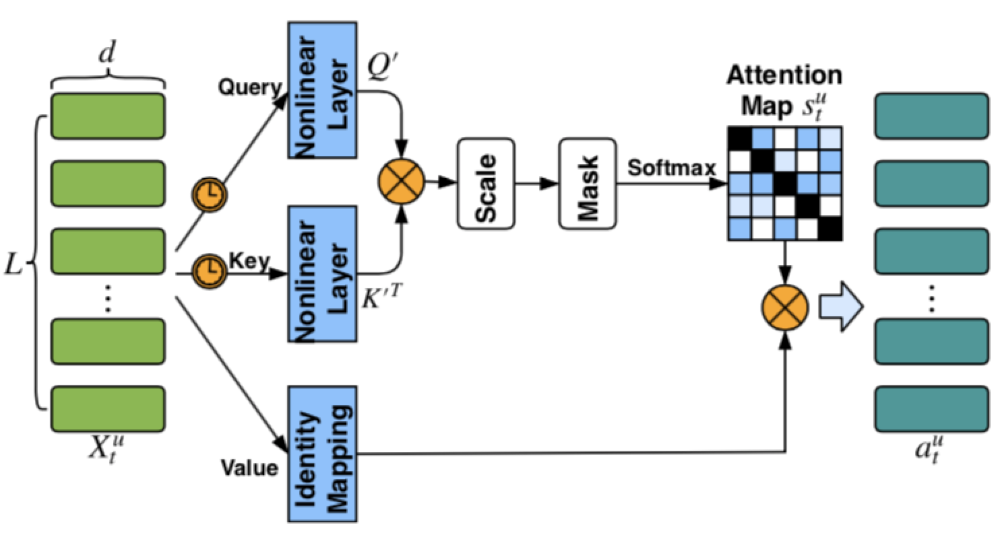
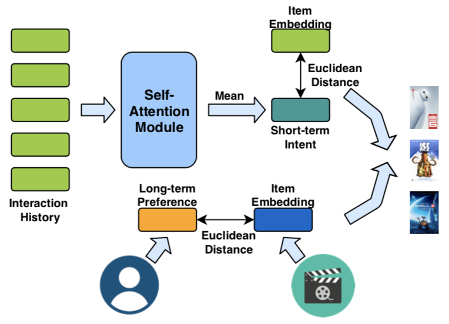

> 作者分别对用户的长期兴趣与短期兴趣建模，得到长期和短期兴趣向量，然后通过欧式距离，分别计算与候选item的得分，再通过加权的方式将长短期得分相加作为最终的排序得分。1. 作者通过`self-attention`对用户近期行为的item建模，然后对attention后的向量集合求`mean`得到用户的短期兴趣向量；2. 通过将用户和item通过另外一个embedding表达，来作为用户的长期兴趣建模；3. 在计算用户与item距离时，作者采用欧式距离而没有采用内积，因为内积不满足`important inequality property`。

#### 短期兴趣建模与Self-Attention Module

作者通过用户近期的行为序列来建模用户的短期兴趣向量，并通过`Self-Attention`对行为序列进行建模。`Self-Attention`计算用户短期兴趣向量的公式如下：

$$
\begin{align}
Q' &= ReLU(X_t^uW_Q) \tag 1 \\
K' &= ReLU(X_t^uW_K) \tag 2 \\
s_t^u &= softmax(\frac{Q'K'^T}{\sqrt{d}}) \tag 3 \\
a_t^u &= s_t^uX_t^u \tag 4 \\
m_t^u &= \frac{1}{L} \sum_{l=1}^{L}{a_{tl}^u} \tag 5
\end{align}
$$

其中，$ X_t^u \in R^{L \times d} $是用户行为序列通过item的embedding词表映射得到的embedding矩阵，$ W_Q, W_K $是$ d \times d $维的权重矩阵，所有用户共享该矩阵，$ m_t^u $即是得到的用户兴趣向量。网络结构如下图：

* 相比于传统的`attention`只能利用全局上下文来学习表达，`self-attention`可以挖掘序列中两两之间的关系;
* $Q'K'^T$除以$\sqrt{d}$同Google的《Attention is all your need》的做法，可以有效缓解当向量维度过大时，容易导致激活值进入softmax饱和区的问题；
* 另外，作者还在计算softmax前先掩掉$Q'K'^T$得到的矩阵对角线值，以避免item自身分配过大的权重；
* 最后，作者直接将

#### 长期兴趣建模

#### 模型框架

